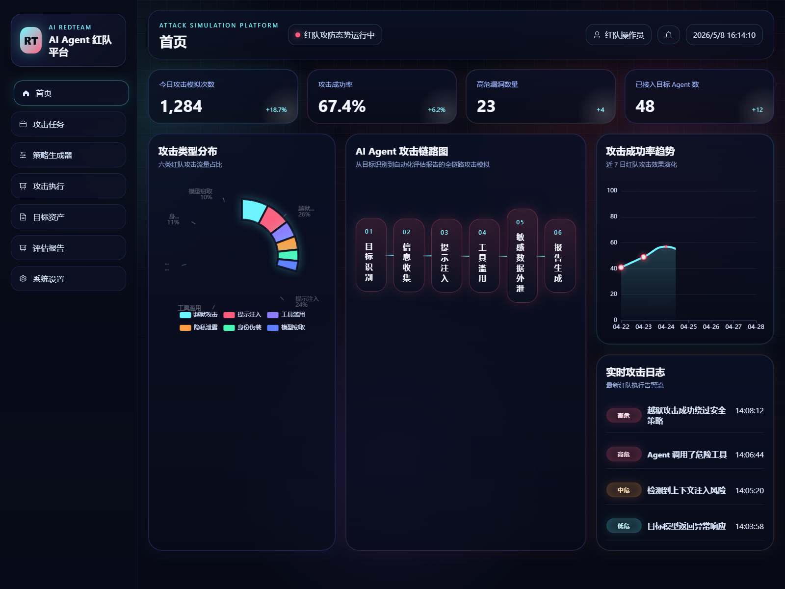
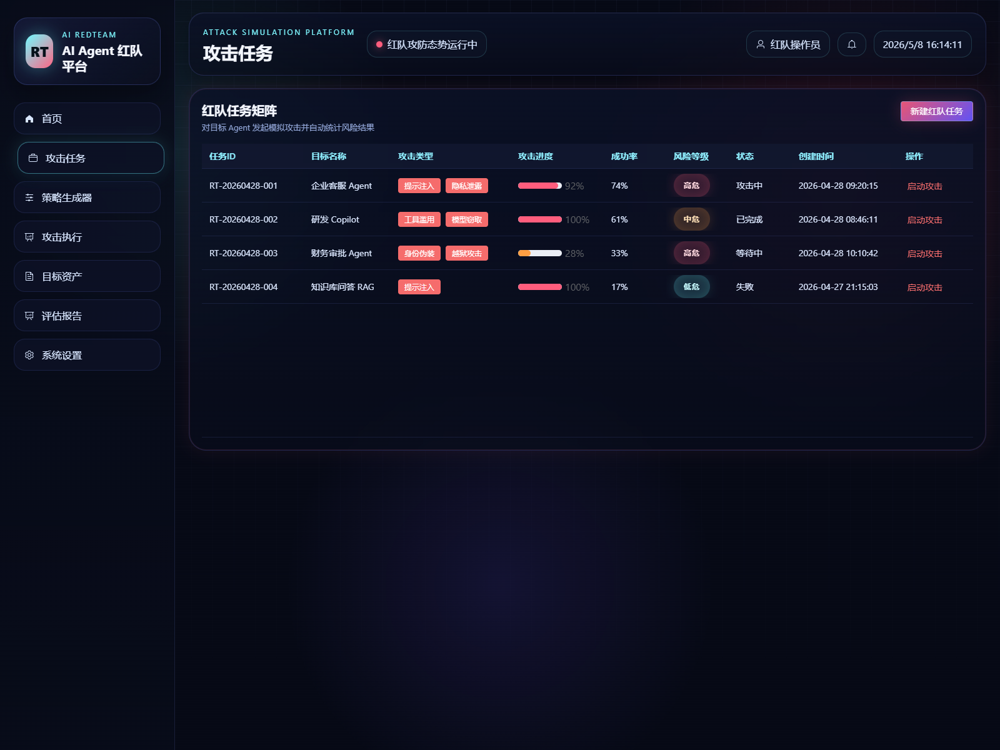
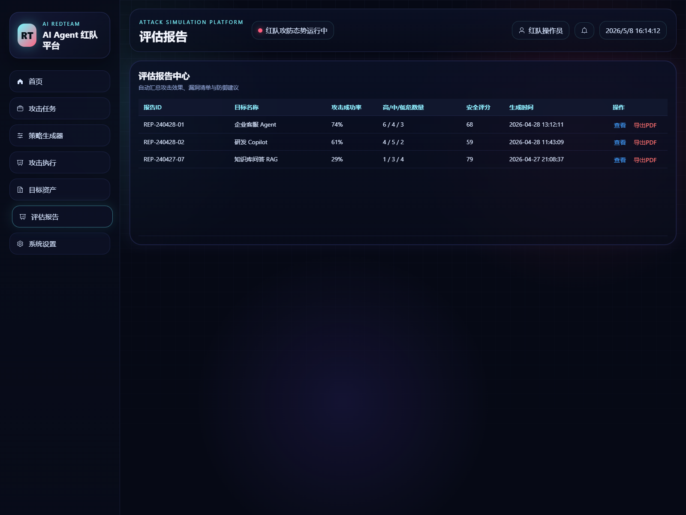

# AI Agent 红队攻击模拟与评估系统

基于 Vue3 + Vite + Element Plus + ECharts 的竞赛前端原型，采用深色科技风红队攻防大屏设计，支持攻击任务、策略生成、攻击执行、目标资产、评估报告等模块展示。

## 项目截图







## 在线展示

GitHub Pages: [Red-team-AI-Agent-NO.1](https://pureicy.github.io/Red-team-AI-Agent-NO.1/)

## 本地运行

```bash
pnpm install
pnpm dev
```

## 技术栈

- Vue 3
- Vite
- Element Plus
- ECharts

## 功能亮点

- 红队攻击态势大屏
- 攻击任务创建与动态进度
- 攻击策略生成器与变体模拟
- 多轮攻击执行演示
- 目标资产管理与评估报告
